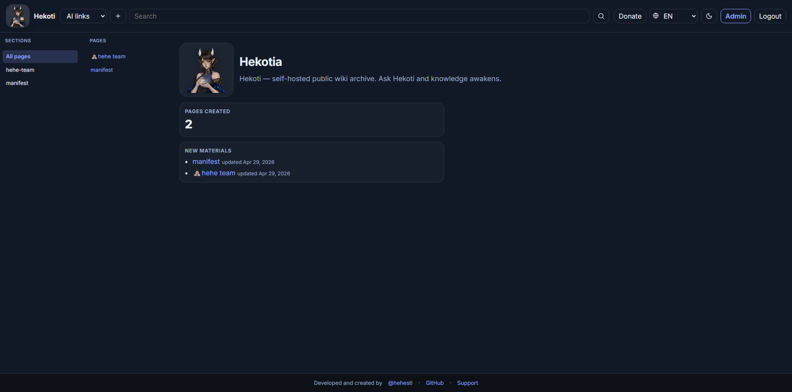

# Hekoti

<p align="center">
  <strong>Self‑hosted public wiki archive with an admin cockpit: Monaco editor, AI chat, webhooks, 2FA, multi‑language UI.</strong>
</p>

<p align="center">
  <a href="#english">English</a> • <a href="#русский">Русский</a>
</p>

<p align="center">
  
</p>

---

## English

### What is Hekoti?

Hekoti is a lightweight, self‑hosted wiki engine for publishing knowledge pages and maintaining them through a modern admin UI.

It’s designed for “public read + private write” deployments: visitors can browse, admins can edit, publish, reorder, and structure pages.

### Killer features

- Public wiki archive + fast sidebar navigation (sections + pages)
- Admin cockpit: create pages, edit Markdown, publish/unpublish, delete, reorder
- URL‑based nesting (like folders): `/en/manifest/why` → section `manifest`, page `why`
- Drag‑and‑drop reordering and quick actions directly in the page tree
- Built‑in Admin AI chat with slash commands (`/agent …`, `/ask …`)
- Multi‑language UI with admin‑selectable default language for guests
- Admin auth with sessions + optional TOTP 2FA
- Optional Redis for caching + rate limits (fallbacks to in‑memory when not set)
- Webhooks (incoming verification + outgoing events)
- Optional LanguageTool spellcheck endpoint

### Core / Engine / Frontend

- **Core engine:** Next.js App Router + server components
- **Database:** PostgreSQL + Prisma (migrations + seed)
- **Auth:** HTTP‑only session cookies, login rate limiting, optional TOTP 2FA
- **Wiki rendering:** Markdown → HTML (`marked`) + sanitization
- **Admin editor:** Monaco‑based Markdown editor with toolbar and context menu
- **I18n:** `/[lang]/…` routes + JSON dictionaries, admin‑controlled default language

### Quick start (Docker)

Requires **Docker Compose v2.24+**.

Zero‑config (defaults live in `docker-compose.yml`):

```bash
docker compose up -d --build
```

Optional tuning:

```bash
cp .env.example .env
# Edit: POSTGRES_*, HEKOTI_ADMIN_*, WEBHOOK_SECRET, etc.
docker compose up -d --build
```

**Migrations:** on each `hekoti-app` start, `docker-entrypoint.sh` runs `npx prisma migrate deploy` (unless `HEKOTI_SKIP_MIGRATE=1`).

**First admin user / demo pages (seed):**

```bash
docker compose exec hekoti-app npx --yes tsx prisma/seed.ts
```

Open: `http://localhost:3310`

### Quick start (local)

```bash
cp .env.example .env
npm install
npm run db:generate
npx prisma migrate dev
npm run db:seed
npm run dev
```

### Configuration highlights

See `.env.example`. Most important:

- `PUBLIC_READ_MODE=true|false` — allow guests to read
- `ENABLED_LANGUAGES=en,ru,…` — UI languages enabled
- `APP_URL=…` — affects cookies and absolute links
- `HEKOTI_ADMIN_EMAIL` / `HEKOTI_ADMIN_PASSWORD` — bootstrap admin for empty DB
- `WEBHOOK_SECRET` / `OUTGOING_WEBHOOK_URLS`
- `AI_AGENTS_JSON` / `AI_LINKS_JSON`
- `DONATE_LINKS_JSON` / `CRYPTO_DONATION_JSON`

### Health checks

- `GET /api/health` — combined probe
- `GET /api/health/live` — process up
- `GET /api/health/ready` — database `SELECT 1`

### Credits

Developed and created by **@hehestl**  
https://t.me/hehestl  
https://github.com/hehestl  
https://t.me/PhiloraBot

---

## Русский

### Что такое Hekoti?

Hekoti — лёгкий self‑hosted движок вики: публикуешь страницы знаний и управляешь ими через современную админку.

Проект заточен под режим “публичное чтение + приватное редактирование”: гости читают, админ создаёт, редактирует, публикует и наводит порядок.

### Киллер‑фичи

- Публичная вики‑база + удобная навигация в сайдбаре (разделы + страницы)
- Админка: создание страниц, Markdown‑редактор, публикация/снятие, удаление, сортировка
- Вложенность через URL (как папки): `/ru/manifest/why` → раздел `manifest`, страница `why`
- Быстрые действия прямо в дереве страниц + drag‑and‑drop сортировка
- Встроенный AI‑чат админа со слеш‑командами (`/agent …`, `/ask …`)
- Полная локализация UI + язык по умолчанию для гостей (настраивается в админке)
- Авторизация админа + опциональная TOTP‑2FA
- Опциональный Redis для кеша и rate‑limit (без Redis работает на памяти)
- Вебхуки (проверка входящих + исходящие события)
- Опциональный LanguageTool для проверки текста

### Ядро / Движок / Фронтенд

- **Ядро:** Next.js App Router + server components
- **База:** PostgreSQL + Prisma (миграции + сид)
- **Авторизация:** HTTP‑only cookies, ограничение попыток входа, опциональная TOTP‑2FA
- **Рендер вики:** Markdown → HTML (`marked`) + санитайз
- **Редактор:** Monaco‑редактор Markdown с тулбаром и контекстным меню
- **Локализация:** маршруты `/[lang]/…` + JSON‑словарики, дефолтный язык через настройки

### Быстрый старт (Docker)

Нужен **Docker Compose v2.24+**.

Запуск без конфигурации (дефолты в `docker-compose.yml`):

```bash
docker compose up -d --build
```

С настройками:

```bash
cp .env.example .env
# Настрой POSTGRES_*, HEKOTI_ADMIN_*, WEBHOOK_SECRET и т.д.
docker compose up -d --build
```

**Миграции:** на каждом старте `hekoti-app` выполняется `npx prisma migrate deploy` (если не выставлен `HEKOTI_SKIP_MIGRATE=1`).

**Первый админ / демо‑страницы (seed):**

```bash
docker compose exec hekoti-app npx --yes tsx prisma/seed.ts
```

Открыть: `http://localhost:3310`

### Быстрый старт (локально)

```bash
cp .env.example .env
npm install
npm run db:generate
npx prisma migrate dev
npm run db:seed
npm run dev
```

### Важные настройки

Смотри `.env.example`. Главное:

- `PUBLIC_READ_MODE=true|false` — разрешить чтение гостям
- `ENABLED_LANGUAGES=en,ru,…` — включённые языки UI
- `APP_URL=…` — влияет на cookies и абсолютные ссылки
- `HEKOTI_ADMIN_EMAIL` / `HEKOTI_ADMIN_PASSWORD` — bootstrap админ для пустой БД
- `WEBHOOK_SECRET` / `OUTGOING_WEBHOOK_URLS`
- `AI_AGENTS_JSON` / `AI_LINKS_JSON`
- `DONATE_LINKS_JSON` / `CRYPTO_DONATION_JSON`

### Хелсчеки

- `GET /api/health`
- `GET /api/health/live`
- `GET /api/health/ready`

### Автор

Разработано и создано **@hehestl**  
https://t.me/hehestl  
https://github.com/hehestl  
https://t.me/PhiloraBot
